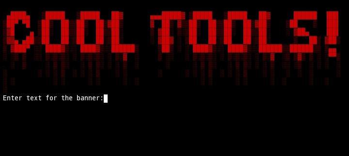
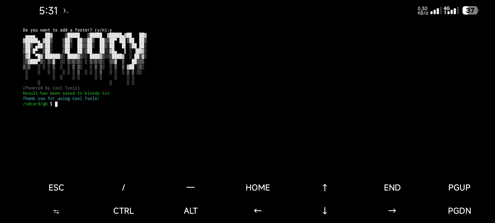
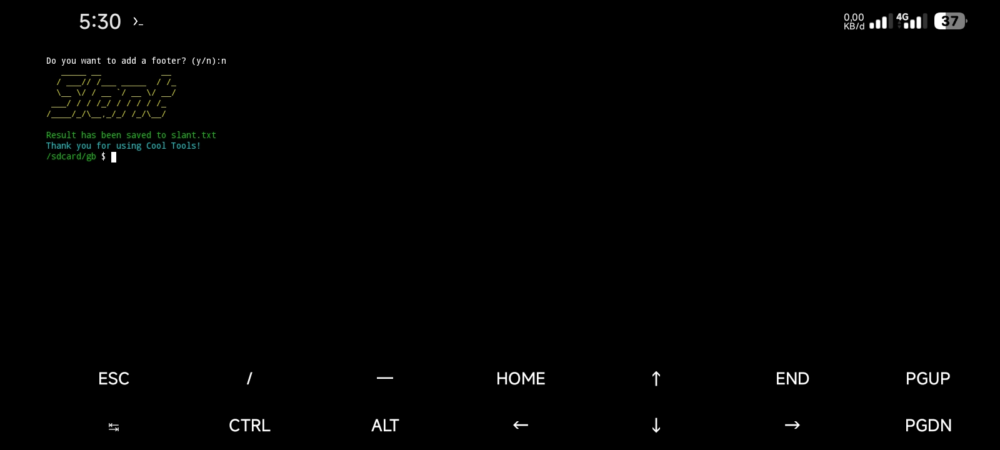
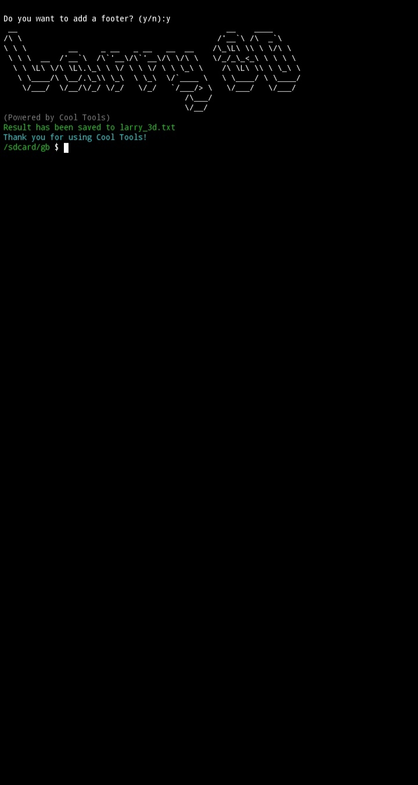
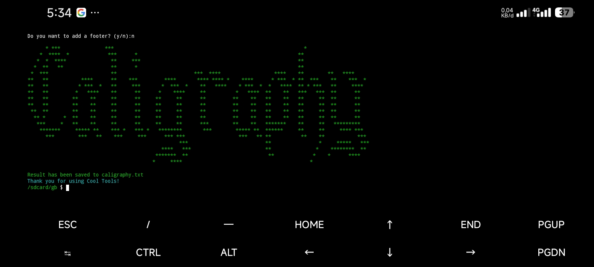
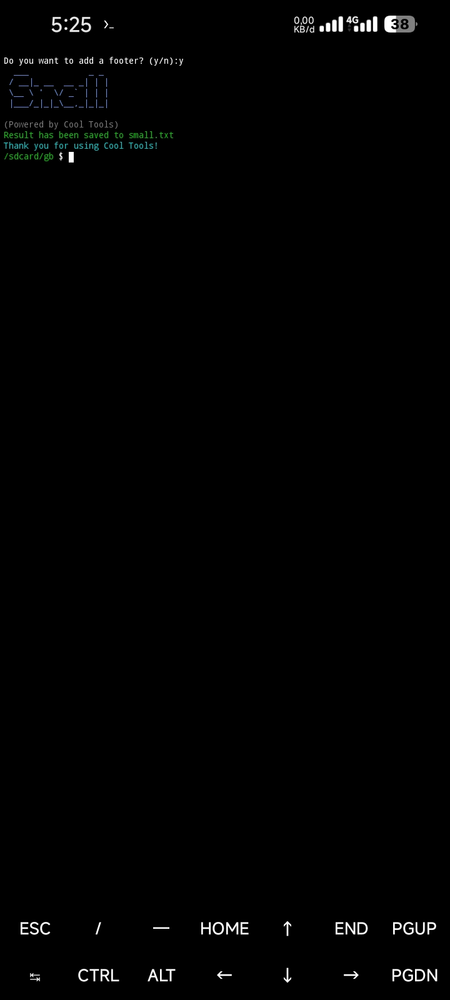
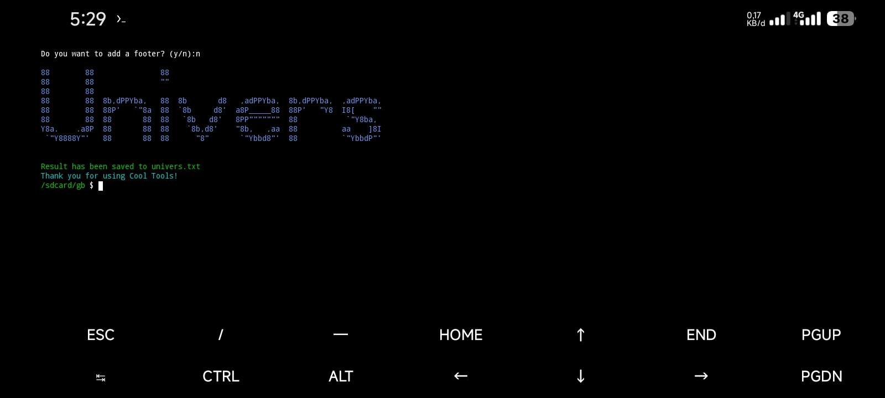
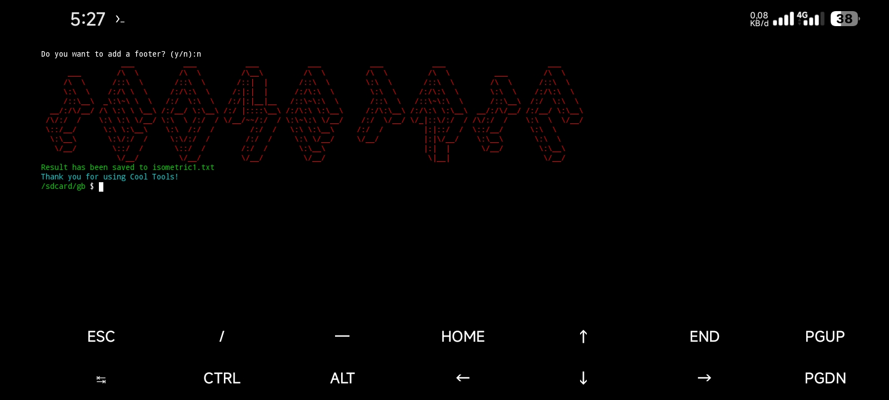

[![Contributors][contributors-shield]][contributors-url]
[![Forks][forks-shield]][forks-url]
[![Stargazers][stars-shield]][stars-url]
[![Issues][issues-shield]][issues-url]


<!-- PROJECT LOGO -->
<br />
<div align="center">
  <a href="https://github.com/RemonCalvius/theme-tools-creator">
    
  </a>

  <h3 align="center">Cool Tools</h3>

  <p align="center">
    200+ Theme For You Tools
  </p>
</div>


## Periview
<p>Bloody</p>

 
<p>Slant</p>

 
 <p>Larry 3D</p>

 
 <p>Caligraphy</p>

 
 <p>Small</p>

 
 <p>Univers</p>

 
<p>Isometric1</p>


 


<p align="right">(<a href="#readme-top">back to top</a>)</p>


### Built With

* Nodejs

<p align="right">(<a href="#readme-top">back to top</a>)</p>


<!-- GETTING STARTED -->
### Installation

1. 
   ```sh
   git clone https://github.com/RemonCalvius/theme-tools-creator.git
   ```
2. 
   ```sh
   npm install
   ```
3.  
   ```sh
   node  .
   ```

<p align="right">(<a href="#readme-top">back to top</a>)</p>


<!-- ROADMAP -->
## Language

    - [+] English
    - [+] Indonesian

<p align="right">(<a href="#readme-top">back to top</a>)</p>


[contributors-shield]: https://img.shields.io/github/contributors/othneildrew/Best-README-Template.svg?style=for-the-badge
[contributors-url]: https://github.com/RemonCalvius/theme-tools-creator/contributors
[forks-shield]: https://img.shields.io/github/forks/othneildrew/Best-README-Template.svg?style=for-the-badge
[forks-url]: https://github.com/RemonCalvius/theme-tools-creator/network/members
[stars-shield]: https://img.shields.io/github/stars/othneildrew/Best-README-Template.svg?style=for-the-badge
[stars-url]: https://github.com/RemonCalvius/theme-tools-creator/stargazers
[issues-shield]: https://img.shields.io/github/issues/othneildrew/Best-README-Template.svg?style=for-the-badge
[issues-url]: https://github.com/RemonCalvius/theme-tools-creator/issues
[contributors-shield]: https://img.shields.io/github/contributors/othneildrew/Best-README-Template.svg?style=for-the-badge
[contributors-url]: https://github.com/othneildrew/Best-README-Template/graphs/contributors
[forks-shield]: https://img.shields.io/github/forks/othneildrew/Best-README-Template.svg?style=for-the-badge
[forks-url]: https://github.com/othneildrew/Best-README-Template/network/members
[stars-shield]: https://img.shields.io/github/stars/othneildrew/Best-README-Template.svg?style=for-the-badge
[stars-url]: https://github.com/othneildrew/Best-README-Template/stargazers
[issues-shield]: https://img.shields.io/github/issues/othneildrew/Best-README-Template.svg?style=for-the-badge
[issues-url]: https://github.com/othneildrew/Best-README-Template/issues


